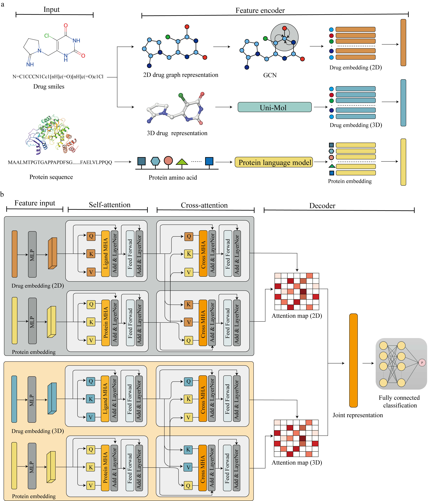

# HitScreen: Robust Deep Learning Framework for Sequence-Based Drug Virtual Screening

The code originates from the article mentioned above. Here, we provide the complete training data, code, and results. If you have any questions or encounter issues running the code, feel free to open an issue or contact me via gengchen17@zju.edu.cn. I am happy to help!

## Framework



## Usage

### 1. Embeddings

#### 1.1 Environment

For the embedding notebooks, you will need the following packages installed (the versions used in the notebooks are provided):

- [Pytorch](https://pytorch.org/get-started/locally/)
- [TensorFlow](https://www.tensorflow.org/install/pip)
- [Transformers](https://huggingface.co/docs/transformers/de/installation)
- [Pandas](https://pandas.pydata.org/docs/getting_started/install.html)

#### 1.2 Example - 11betaHSD1 Prediction Task using Ankh_Large

To generate embeddings for your own datasets, run the 11betaHSD1 example cell in the [/drug_and_target_embedding](./drug_and_target_embedding.ipynb) notebook to compute the embeddings.

#### 1.3 Supported Pretrained PLMs and Uni-Mol

The following pretrained models are supported for embeddings:

| Model | Huggingface Checkpoints |
| --- | --- |
| [Ankh-base](https://arxiv.org/abs/2301.06568) | "ElnaggarLab/ankh-base" |
| [Ankh-large](https://arxiv.org/abs/2301.06568) | "ElnaggarLab/ankh-large" |
| [ProtT5](https://ieeexplore.ieee.org/document/9477085) | "Rostlab/prot_t5_xl_uniref50" |
| [ESM-2 8M](https://www.science.org/doi/full/10.1126/science.ade2574) | "facebook/esm2_t6_8M_UR50D" |
| [ESM-2 35M](https://www.science.org/doi/full/10.1126/science.ade2574) | "facebook/esm2_t12_35M_UR50D" |
| [ESM-2 150M](https://www.science.org/doi/full/10.1126/science.ade2574) | "facebook/esm2_t30_150M_UR50D" |
| [ESM-2 650M](https://www.science.org/doi/full/10.1126/science.ade2574) | "facebook/esm2_t33_650M_UR50D" |
| [ESM-2 3B](https://www.science.org/doi/full/10.1126/science.ade2574) | "facebook/esm2_t36_3B_UR50D" |
| [Uni-MOL](https://openreview.net/forum?id=6K2RM6wVqKu) | "dptech/Uni-Mol-Models" |

### 2. Training

The original datasets are available on Zenodo(https://zenodo.org/records/15233831), which includes the preprocessed ChemBL 33 dataset as well as the augmented dataset. The data augmentation code is located in `./data_augmentation/data_augmentation.py`. 

If you have new data, follow step 1 to preprocess and generate embeddings before proceeding with training.

To train a model with the provided script, use the command:

```bash
python main.py
```

### 3. Using the Provided Model Weights for Screening a Compound for Your Target Protein

We provide three models for screening, including:

- HitScreen(Ankh Large)
- HitScreen(ESM-2 150M)
- HitScreen(ProtT5)

Along with the corresponding model weights for the versions without UniMol. If your screening dataset of molecules is very large, you can use the GCN-encoded version for screening. The performance may slightly decrease, but processing time will be significantly reduced. Below are the results using the DEKOIS2.0 dataset:

| Model                     | EF1% with UniMol | EF1% without UniMol |
| ------------------------- | ---------------- | ------------------- |
| HitScreen(Ankh_large)      | 15.679           | 12.222              |
| HitScreen(ProtT5)          | 14.754           | 11.791              |
| HitScreen(ESM-2 150M)      | 14.907           | 11.944              |

For an example of screening the 11betaHSD1 task, refer to the example cell in the `/drug_and_target_embedding` notebook. Protein embeddings and molecular embeddings are also available on Zenodo(https://zenodo.org/records/15234903).

If you plan to use only the GCN model, modify the following parameters:

```bash
python screening_11betaHSD1.py
--is_unimol_Ligand False
--decoder_in_dim 128
```

### 4. Using the Provided Model Weights for Evaluation and Reproducing Benchmark Results

We evaluated the models using the DUD-E and DEKOIS2.0 datasets. The UniProt-mapped versions of the datasets are available on Zenodo(https://zenodo.org/records/15233905).

### 5. System Requirements

The source code was developed using Python 3.8 and PyTorch 1.7.1. The required Python dependencies are listed below:

```bash
torch>=1.7.1
dgl>=0.7.1
dgllife>=0.2.8
numpy>=1.20.2
scikit-learn>=0.24.2
pandas>=1.2.4
prettytable>=2.2.1
rdkit~=2021.03.2
yacs~=0.1.8
comet-ml~=3.23.1 # optional
