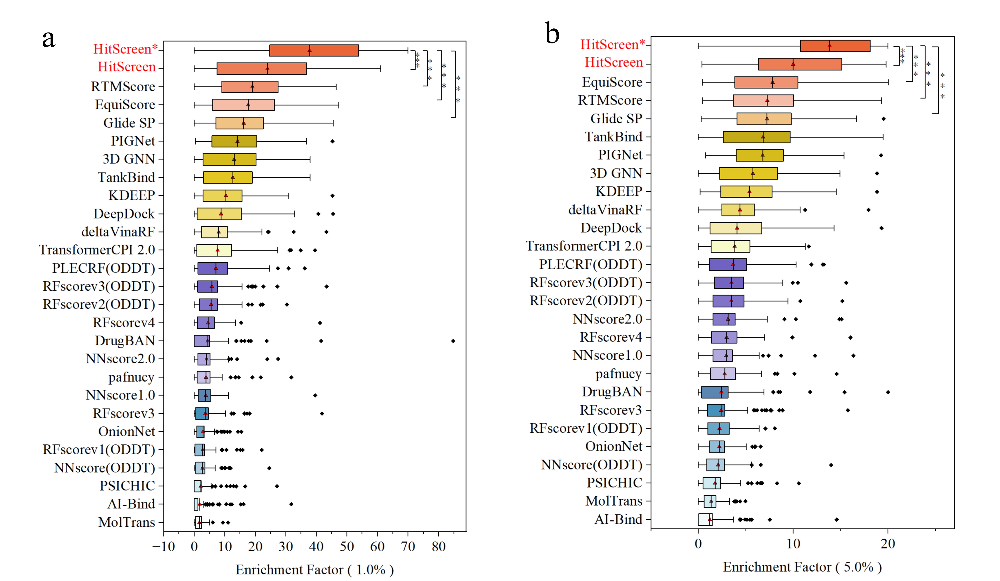

# HitScreen: A Sequence-Based Drug Virtual Screening Approach Using Data Augmentation and Protein Language Models

[](https://python.org)
[](https://pytorch.org)
[](LICENSE)
[](https://pubs.acs.org/journal/jcisd8)

**A sequence-based drug virtual screening approach using data augmentation and protein language models.**

[📖 Paper](http://pubs.acs.org/doi/abs/10.1021/acs.jcim.5c01753) | [📊 Data](https://zenodo.org/records/15233831) | [🤗 Models](https://github.com/chengeng17/HitScreen)

---

## 🎯 Overview

HitScreen is a deep learning-based drug-target interaction (DTI) prediction framework designed for drug virtual screening. The project combines:

- **Protein Language Models**: Support for multiple pre-trained models (Ankh, ESM-2, ProtT5, etc.)
- **Molecular Representation Learning**: Using Uni-Mol and GCN for molecular encoding
- **Data Augmentation**: Techniques to improve model generalization
- **Efficient Screening**: Support for rapid screening of large compound libraries

### ✨ Key Features

- **High Accuracy**: Excellent performance on DUD-E and DEKOIS2.0 datasets
- **Easy to Use**: Complete training and inference scripts provided
- **Extensible**: Support for multiple pre-trained models and custom datasets
- **Efficient**: GCN-encoded version significantly improves processing speed

---

## 🏗️ Framework


---

## ⚡ Quick Start

### Installation

```bash
pip install torch>=1.7.1 dgl>=0.7.1 dgllife>=0.2.8 numpy>=1.20.2 scikit-learn>=0.24.2 pandas>=1.2.4 prettytable>=2.2.1 rdkit~=2021.03.2 yacs~=0.1.8
```

## 🔄 Data Augmentation

### Data Augmentation Code

The data augmentation code is located at `./data/data_augmentation.py`. This script generates negative samples for training by replacing protein targets while keeping the same molecule structure.

### Prerequisites

**Protein Target Clustering**: First, protein targets need to be clustered. We recommend using:
- **[CD-HIT](https://github.com/weizhongli/cdhit)**: For sequence similarity clustering
- **[MMseqs2](https://github.com/soedinglab/MMseqs2)**: For more efficient clustering of large datasets

### Input Format

The input CSV file should contain the following columns:
- `SMILES`: Molecular SMILES strings
- `Protein`: Protein sequences or identifiers
- `Y`: Binary labels (1 for positive, 0 for negative)
- `target_cluster`: Cluster ID for protein targets

### Usage

```bash
# Basic usage
python data/data_argument.py \
    --input ./data_augmentation_case.csv \
    --output ./data_augmentation_case_result_1.csv
```

### Training

Before training, prepare the embeddings for your training data using the script at `./data/drug_and_target_embedding.ipynb`.

```bash
python main.py
```
---

## 💾 Supported Models

The following pretrained models are supported for embeddings:

| Model | Huggingface Checkpoints |
| --- | --- |
| [Ankh-base](https://arxiv.org/abs/2301.06568) | "ElnaggarLab/ankh-base" |
| [Ankh-large](https://arxiv.org/abs/2301.06568) | "ElnaggarLab/ankh-large" |
| [ProtT5](https://ieeexplore.ieee.org/document/9477085) | "Rostlab/prot_t5_xl_uniref50" |
| [ESM-2 8M](https://www.science.org/doi/full/10.1126/science.ade2574) | "facebook/esm2_t6_8M_UR50D" |
| [ESM-2 35M](https://www.science.org/doi/full/10.1126/science.ade2574) | "facebook/esm2_t12_35M_UR50D" |
| [ESM-2 150M](https://www.science.org/doi/full/10.1126/science.ade2574) | "facebook/esm2_t30_150M_UR50D" |
| [ESM-2 650M](https://www.science.org/doi/full/10.1126/science.ade2574) | "facebook/esm2_t33_650M_UR50D" |
| [ESM-2 3B](https://www.science.org/doi/full/10.1126/science.ade2574) | "facebook/esm2_t36_3B_UR50D" |
| [Uni-MOL](https://openreview.net/forum?id=6K2RM6wVqKu) | "dptech/Uni-Mol-Models" |

### 🚀 Model Variants

- **Ankh-Large**: Trained with removal of targets within the same class
- **Ankh-Large***: Trained with removal of identical target-ligand pairs
- **No Uni-Mol Version**: Available for large datasets to significantly reduce embedding preparation time

>  **Tip**: For large datasets, we recommend using the no Uni-Mol version to greatly reduce data preparation and embedding time.

---

## 📊 Results



*Performance on DUD-E datasets*

---

## 🔧 Single Target Screening

### Generate Embeddings

Run the example in [`drug_and_target_embedding.ipynb`](./data/drug_and_target_embedding.ipynb) to generate embeddings for your datasets, then run the screening script:

```bash
python screening_11betaHSD1.py
```

### GCN Model (Faster Screening)

```bash
python screening_11betaHSD1.py \
    --model_path ./model/Ankh_Large/without_Uni-Mol/Ankh_Large_model.pth \
    --is_unimol_Ligand False \
    --decoder_in_dim 128
```

---

##  📁 Data

- **ChEMBL 33**: [Download](https://zenodo.org/records/15233831)
- **DUD-E & DEKOIS2.0**: [Download](https://zenodo.org/records/15233905)
- **Enrichment factor calculation**: The code for computing enrichment factors is located at `./data/screening_power_csv.py`

---


## 📧 Contact

- **Email**: gengchen17@zju.edu.cn

---

## 📝 Citation

```bibtex
@article{doi:10.1021/acs.jcim.5c01753,
  author = {Chen, Geng and Liao, Jinbiao and Yu, Yanzhen and Le, Kaixin and Zhao, Hui and Qin, Yiyang and Cai, Lvtao and Sheng, Rong},
  title = {HitScreen: A Sequence-Based Drug Virtual Screening Approach Using Data Augmentation and Protein Language Models},
  journal = {Journal of Chemical Information and Modeling},
  volume = {0},
  number = {0},
  pages = {null},
  year = {0},
  doi = {10.1021/acs.jcim.5c01753},
  note = {PMID: 40955139},
  url = {https://doi.org/10.1021/acs.jcim.5c01753},
  eprint = {https://doi.org/10.1021/acs.jcim.5c01753}
}
```

---

<div align="center">

**⭐ If this project helps you, please give us a star!**

</div>

